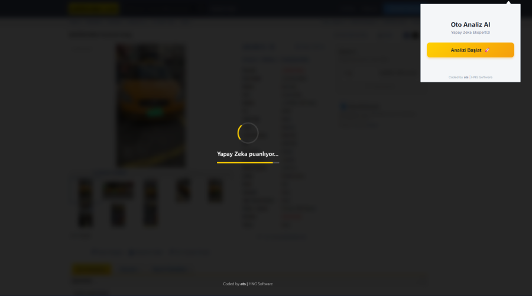
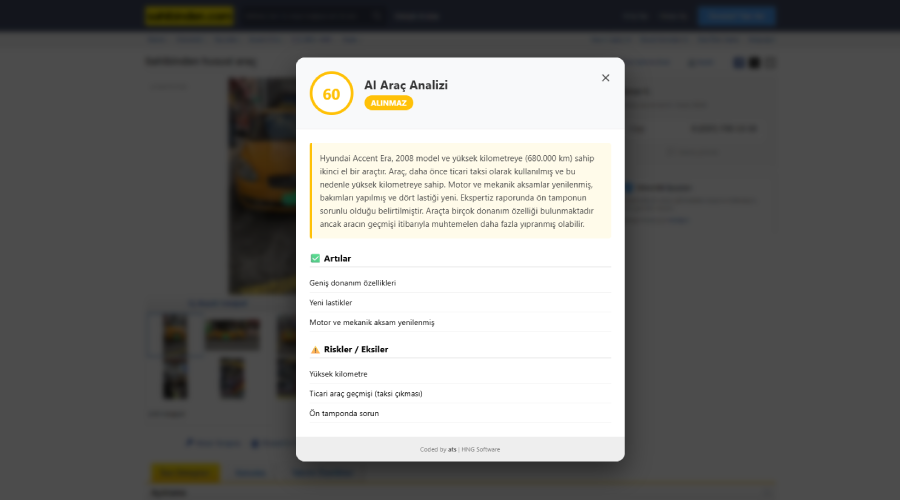

# Sahibinden Oto Analiz AI


**sahibinden.com** üzerindeki araç ilanlarını yapay zeka ile analiz eden, ekspertiz raporlarını okuyan ve fiyat/performans değerlendirmesi yapan gelişmiş bir Chrome Eklentisi.

Bu proje; ilanın başlığını, fiyatını, açıklamasını, donanım listesini ve ilan fotoğraflarını tarayarak **GPT-4o Vision** modeline gönderir ve detaylı bir alım tavsiyesi sunar.

<p align="center">
  
  &nbsp; &nbsp; 
</p>

## Özellikler

* **Tam Sayfa Analiz:** İlan detay sayfasındaki tüm teknik verileri ve satıcı açıklamasını okur.
* **AI Görsel Tarama:** GPT-4o Vision ile aracın fotoğraflarını analiz eder (Kozmetik kusurlar, döşeme durumu vb.).
* **Gizli Özellik Tespiti:** Donanım listesindeki özellikleri kategorize eder (Güvenlik, Multimedya vb.).
* **Ekspertiz Okuma:** "Boyalı/Değişen" tablosunu okur ve rapora işler.
* **Sinematik UI:** Sayfa üzerinde modern, animasyonlu bir yükleme ekranı ve sonuç penceresi (Modal) açar.
* **backend-less Yapı:** n8n veya basit bir API endpoint ile entegre çalışır.

## Kurulum

Bu eklenti henüz marketlerde yayınlanmamıştır. **Geliştirici Modu (Developer Mode)** ile tüm Chromium tabanlı tarayıcılara (Chrome, Edge, Opera, Brave) yükleyebilirsiniz.

1.  Bu repoyu bilgisayarınıza indirin (Clone veya Download ZIP).
2.  Kullandığınız tarayıcıyı açın ve adres çubuğuna ilgili uzantı adresini yazın:
    * **Google Chrome / Brave:** `chrome://extensions`
    * **Opera:** `opera://extensions`
3.  Sayfanın kenarındaki (genelde sağ üstte) **Geliştirici Modu (Developer Mode)** anahtarını açın.
4.  Sol üstte beliren **Paketlenmemiş öğe yükle (Load unpacked)** butonuna tıklayın.
5.  İndirdiğiniz proje klasörünü seçin.

## Yapılandırma (Önemli)

Eklentinin çalışması için bir Backend servisine (OpenAI ile iletişim kuracak bir köprüye) ihtiyacı vardır.

1.  `popup.js` dosyasını açın.
2.  Aşağıdaki satırı bulun ve kendi n8n webhook veya API adresinizle değiştirin:
    ```javascript
    const n8nUrl = "YOUR_N8N_WEBHOOK_URL_HERE";
    ```
    *(Eğer n8n kullanıyorsanız, HTTP Request node'u ile GPT-4o bağlantısı kurmanız gerekir.)*

## Kullanılan Teknolojiler

* **Frontend:** HTML5, CSS3, Vanilla JavaScript (Manifest V3)
* **Backend / Workflow:** n8n (Workflow Automation)
* **AI Model:** OpenAI GPT-4o (Vision Capabilities)

## Nasıl Çalışır?

1.  sahibinden.com'da bir araba ilanına girin.
2.  Eklenti ikonuna tıklayın ve **"Analizi Başlat"** butonuna basın.
3.  Sayfa üzerinde bir yükleme ekranı belirir ve veriler toplanır.
4.  Yapay zeka analizi bitince sonuçlar detaylı bir pencerede (Modal) gösterilir.

## Lisans

Bu proje açık kaynaklıdır ve kullanıma açıktır. Ticari kullanım için OpenAI API maliyetlerini göz önünde bulundurunuz.

---
<div align="center">
  <strong>Coded by ats | HNG Software</strong>
</div>